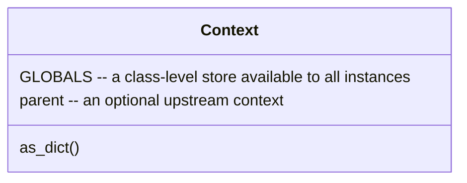
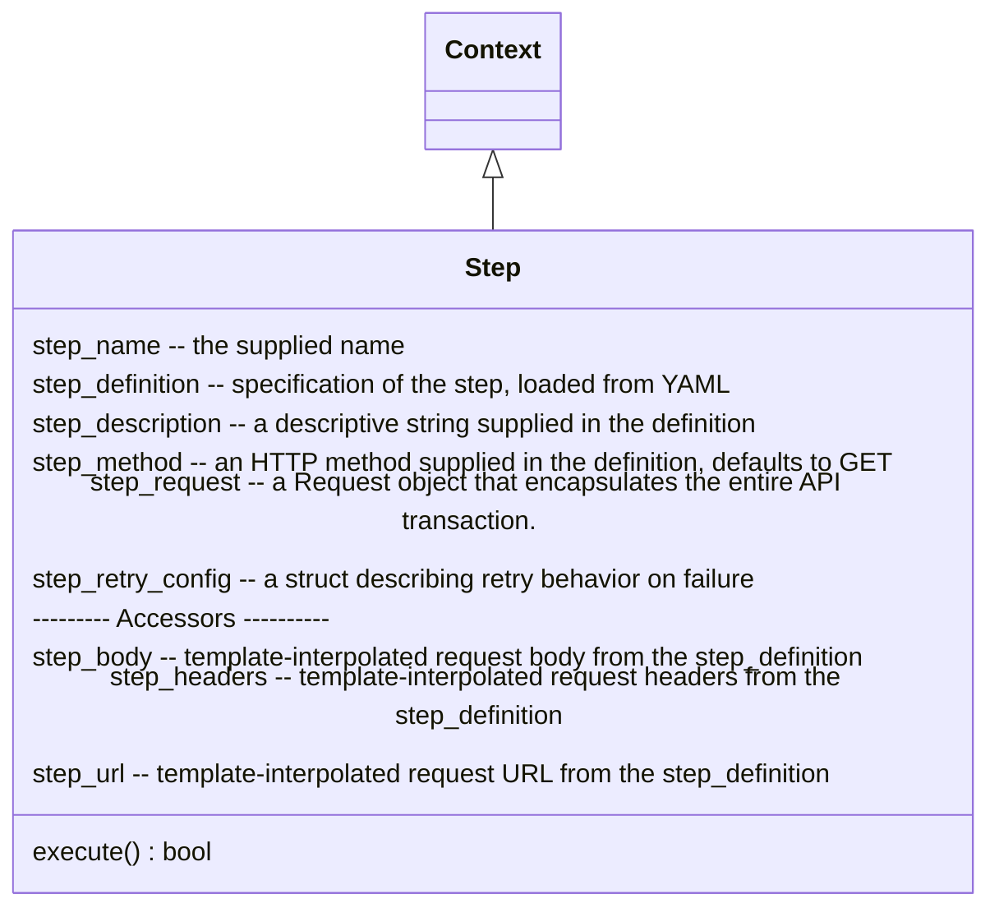
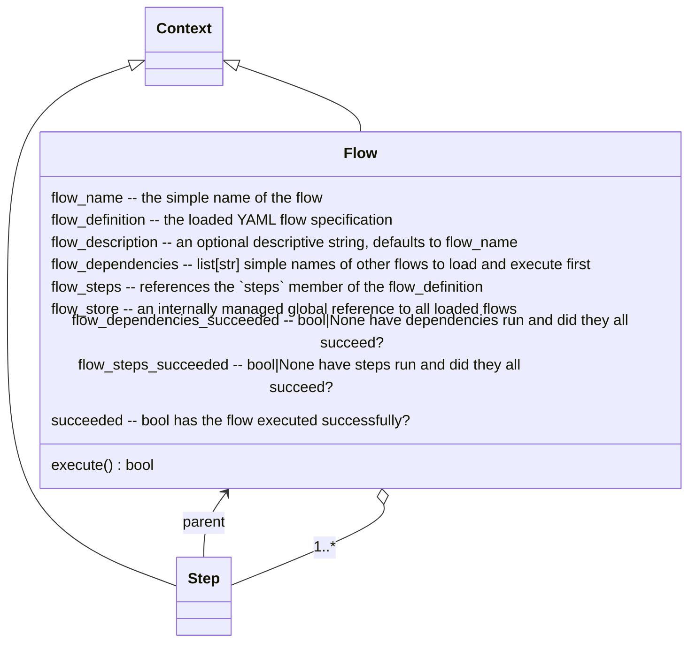

# api-flow
This utility allows the user to define, in YAML, “flows” composed of “steps,” each of which performs a single API 
request, and execute them. Steps can extract values from their responses and expose them for
consumption by later steps and the user.

Intended use cases include automated QA of API processes and automation of workflows across multiple
endpoints and services, in a lightweight form that can run in restricted environments.

## Moving Parts
### Context
Flows and steps are derived from the `Context` class. It exposes data using either object 
(`context.my_data_item`) or dict (`context['my_data_item']`) notation, and provides support for 
referring attributes requests up to a `parent` context. For example, the `parent` of a Step is 
the Flow that executes it.

The resolution order for context attributes is as follows:
- The instance's own native attributes
- Environment variables
- Items in the `GLOBALS` store
- The context's `parent` (if any)
- (`dict` access methods exposed to provide dict-like behavior)

Setting an attribute on a context sets the native value, so that will take precedence
on future requests.

In order to preserve nested object notation for access, dict values are transparently (and
recursively) "upgraded" to a class representation. You can "downgrade" these back to `dict`
(for instance if you need to serialize a value) using the `as_dict` method.

### Steps
The basic unit of work is the `Step` class. It represents a single API call. You will typically not 
instantiate one directly, but you will deal with them as parts of a Flow.


Step definitions are embedded in the YAML defining a flow, and are structured like this:
```yaml
description: My Cool Step
method: POST
url: http://{? my_site_url ?}/do/the/thing
headers:
  X-Additional-Headers: to append to (or override) the default request headers
body: (see below)
wait_for_success: (see below)
outputs:
  my_output_var: (a jsonpath expression -- see below)
```

Note the `{? my_site_url ?}` in the `url` field. This is a substitution point for a variable
extracted from context.

The `body` field can be a string, or it can be, e.g., `template:my_cool_flow_body.json` to load
a template file, or it can be structured YAML. If you use structured YAML, this content will be
reformatted as JSON to form the request body.

The `wait_for_success` field defines the `step_retry_config` for the step. The retry configuration
has two fields:
- `attempt`: the number of times to try a failing request
- `delay`: seconds to pause in between request attempts. If provided this applies to every attempt,
_including the first one_.

You can specify both of these directly under a `wait_for_success` dict key. Alternately, simply
doing `wait_for_success: true` in your definition will supply a default config (three attempts
with five-second delay). Omitting the `wait_for_success` field results in a no-retry configuration
(one attempt, zero delay).

The `outputs` of the step are defined as a map of variable names to [JSONPath](https://jsonpath.com/)
expressions, which are applied to the body of a JSON response to extract the value. These
variables are assigned to the Step for later access, so that `my_cool_step.my_output_var` refers
to the value extracted from the response body.

> **Caution:** a zero delay with a positive retry will spam retries of failing requests as fast as it can. 

The `execute()` method runs the flow (including all retries if applicable) and returns `True` if the
final request attempt succeeded.

### Flows
Flows are what you actually execute. They are loaded from YAML files and define a set of Steps to
execute in sequence. Flows can also optionally declare a set of other prerequisite flows that supply
step outputs the current flow depends on.


The constructor for a `Flow` looks like this:
```python
def __init__(flow_name, profile=None, profiles=None, parent=None, **kwargs):
```
At least the `flow_name` is required, which specifies which YAML specification to load.
Profiles, which can be specified in single or plural form as shown above, are names referencing
"profile" YAML files, which supply initial context variables. The `parent` keyword arg is used 
when constructing prerequisite flows. You typically will not pass it directly. Any additional
`kwargs` supplied in construction are added to the context after profiles are loaded.

The YAML for a flow is specified like so:
```yaml
description: My Cool Flow
depends_on:
  - prerequisite_flow
  - another_prerequisite_flow
  - ...
steps:
  my_cool_step: (see step definition above) 
  ...
```
Step items are assigned to their containing Flow using the simple name, so that in the example
above, after the Flow is executed, `my_cool_flow.my_cool_step` will refer to that Step object.

Calling `execute` on the flow first runs all prerequisites defined by the `depends_on` field, in order,
then assuming those all succeed, runs the steps in the `steps` field in order. The flow succeeds if
all dependencies and steps succeed.

## Extracting Results
As seen above, steps are accessible via their flows, and outputs are available via their steps,
so if you construct and execute a flow (`flow = Flow('my_cool_flow')`, `flow.execute()`) then you
will be able to access step attributes as `value = flow.my_cool_flow.my_cool_step.my_output_var`.

This is the same syntax you will use in template tags, except you will omit the `flow` root.
In rendering a template substitution, the context is always the current step, which inherits values
from the current flow, and then from the profiles. In templates for `my_second_step`, you can
use `{? my_first_step.an_output ?}` to use values from previous steps in the flow.

Any prerequisite flows (specified by `depends_on`) are also available by name on the flow, so they can
be accessed using `{? prerequisite_flow.prereq_step.output_value ?}`.

## Configuration
`api-flow` pulls configuration from files in from a few data directories.  The default structure for data paths is:
```text
./
    flows/
    functions/
    profiles/
    templates/
```
The default base data path is the current directory, with defined subdirectories underneath. The values for each of
these can be changed by setting values on the `Config` object or setting environment variables.

### Data Path
The data path is a common root directory in which all other directories are located by default. The data path is
irrelevant if all other paths are set explicitly.  It defaults to the current directory, but can be changed using
`Config.data_path` or the `DATA_PATH` environment variable.

### Flow Path
Flow files contain the definition of your flows. They are found in the "flows" directory, and have the following YAML
structure:

- `depends_on`: (optional) A list of strings describing other flows that must be run, in order, to populate the context
for this flow to execute.
- `description`: (optional) A human-readable string describing the flow. If omitted, the flow name is used to describe
the flow.
- `steps`: An ordered dictionary of steps for the flow.  Steps can contain the following values:
   - `description`: (optional) A human-readable description of the step. If omitted, the step name is used instead.
   - `wait_for_success`: (optional) If defined, retry support is enabled for this step.  You can just use `true` here
to use a default configuration (3 attempts, 5 seconds between attempts), or you may set the values directly using a
dict value:
       - `attempt`: (optional, default 3) A maximum number of times a request will be attempted.
       - `delay`: (optional, default 5) A number of seconds to pause.  If specified every attempt (including the first
one) will be preceded by a sleep for the requested time.
   - `url`: (required, template) The URL to request
   - `method`: (optional, default GET) The HTTP request method to use.
   - `headers`: (optional, template) A dict of key/value pairs sent as request headers. This will be combined with a
set of default headers.
   - `body`: (optional, template) The body to be sent with a POST/PUT/PATCH etc request.  This can be defined in YAML 
format but will be translated to JSON in the request.
   - `output`: A dictionary of variables that should be extracted from the response data.  Each key is a variable name, 
and the value is a `jsonpath` expression describing where that value can be found in the response JSON. After
retrieval, the values are attached as variables to the Step object so that they can be consumed by later steps.

Values marked with the "template" tag will have values substituted in from the current context before rendering, so that
you can inject variables, including outputs from previous steps, into their values.

The flow path defaults to `<data_path>/flows` but can be overridden using `Config.flow_path` or the `FLOW_PATH`
environment variable.

### Function Path
The api-flow template mechanism provides support for extremely simple functions, and renders their output as the
template substitution.  Two built-in functions are currently provided:

- `random(maxval)` produces a stringified random number in the range [0-maxval).  The string is fixed-width and
zero-padded to the digit width of maxval-1.
- `uuid()` produces a random UUID in v4 format.

Users may also supply their own functions in the `functions` directory. To be usable, you must have an `__init__.py` file
in the functions directory to make it visible as a module. The available functions (whether defined here or not) must
be exposed in the `__init__` file as well. If an unrecognized function is encountered in a template, this is where
api-flow will try to find it.

Functions are of the form:
```python
def my_custom_function(context, <...other args>):
    <implementation here>
    return "some-stringable-value"
```

Functions must be extremely basic. Their arguments (if any) must be expressible as JSON primitives, and their return
values must be convertible to `str`.  It is also not possible to perform any nested template substitution. This last
limitation is mitigated somewhat by the fact that the current context is passed as the first parameter of the function.

The function path defaults to `<data_path>/functions` but can be overridden using `Config.function_path` or the
`FUNCTION_PATH` environment variable.

### Profile Path
Profiles are a base set of variables exposed to your scripts. You can use them to set up static data your flow needs.
Profiles are defined in YAML files, which _must_ be dictionary-shaped at the root. 

You may provide profiles when constructing a `Flow` object or using the `execute` convenience command. Multiple profiles 
can be combined in a single flow run, and subdirectories are supported for organization.  When specifying profiles,
omit the `.yaml` extension.

#### Example:
```text
flow = execute('my_flow', profiles=['environment/stable', 'variant/green'])
```
This will load, e.g., `environment/stable.yaml` from the profiles directory and merge the values it contains into a
common context. Values in profiles specified later in the list take precedence over earlier ones, and if a single
profile is specified in the `profile=` option, that will take the highest precedence.

The profile path defaults to `<data_path>/profiles` but can be overridden using `Config.profile_path` or the 
`PROFILE_PATH` environment variable.

### Template Path
Templates are text files (of any sort) that can contain markup for substitution, (e.g., `My variable is {? my_var ?}`).
This directory contains a collection of body (or other) templates in JSON format.  It defaults to
`{DATA_PATH}/templates` but can be overridden by the `TEMPLATES_PATH` environment variable.  You can reference a
template file in flow configuration by using the value `template:template_filename` in the flow YAML.  So you can define
a flow step where the body is a template:

```yaml
my_step:
  url: http://my-endpoint
  method: POST
  body: template:my-step-body.json
```

When the step is executed, `my-step-body.json` will be read in from the templates directory and substitutions will be
performed on any `{? substitution_tags ?}` inside.

## Running Flows
It is possible to construct an instance of the `Flow` class exported from api-flow directly, but it is easier to use
the `execute` convenience function:

```python
from api_flow import execute

flow = execute('my_cool_flow', profile='my_environment')
```

The arguments to `execute` are the same as those to the Flow constructor. This example will load and 
run `my_cool_flow` with the `my_environment` profile and return the constructed `Flow` object, which 
you can then use to extract the outputs for further use.

During the run, request and response data will be output to the console for diagnostic purposes.

This example would load `my_body_template.json` from the templates directory, interpolate any variable substitutions 
defined in `{?…?}` format, and then use that as the body of the request to `https://example.com/my_step`.
